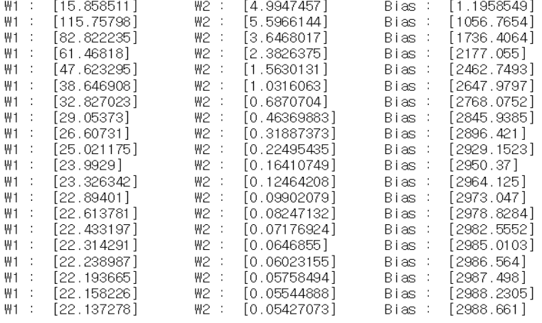

# 인공지능

```
목차
1. 인공지능이란?
2. 머신러닝
	2-1. 지도학습
	2-2. 비지도학습
	2-3. 강화학습
3. 딥러닝
4. 영화 혹은 생활속의 AI
5. 향후전망
```


## 1. 인공지능이란?

**인공지능**은 인간이 지닌 지적능력의 일부 또는 전체를 인공적으로 구현한 것이다. 현실에서는 이제 막 한걸음을 내딛은 단계이며 SF물에서 흔히 볼 수 있는 소재이기도 하다.

> 인공지능 ⊃ 기계학습 ⊃ 인공신경망 ⊃ 딥 러닝

**인공 지능** 분야에는 몇 가지 기술이 있다. **기계 학습**은 기본적인 규칙만 주어진 상태에서 입력받은 정보를 활용해 스스로 학습하는 것이다. **인공 신경망**이란, 인간의 뉴런 구조를 본떠 만든 기계 학습 모델이다. **딥 러닝**은 입력과 출력 사이에 있는 인공 뉴런들을 여러개 층층히 쌓고 연결한 인공신경망 기법을 주로 다루는 연구이다. 즉, 단일 층이 아닌 실제 뇌처럼 여러 계층으로 되어있다. **인지 컴퓨팅**은 기계학습을 이용하여 특정한 인지적 과제를 해결할 수 있는 프로그램 또는 솔루션을 이야기한다. 끝으로, **뉴로모픽 컴퓨팅**은 인공신경망을 하드웨어적으로 구현한 것이라고 생각하면 된다.


## 2. 머신러닝


### 2.1 지도학습

**지도 학습** (Supervised Learning)은 훈련 데이터(Training Data)로부터 하나의 함수를 유추해내기 위한 기계학습(Machine Learning)의 한 방법이다. 훈련 데이터는 일반적으로 입력 객체에 대한 속성을 벡터 형태로 포함하고 있으며 각각의 벡터에 대해 원하는 결과가 무엇인지 표시되어 있다. 이렇게 유추된 함수 중 연속적인 값을 출력하는 것을 회귀분석(Regression)이라 하고 주어진 입력 벡터가 어떤 종류의 값인지 표식하는 것을 분류(Classification)라 한다. 지도 학습기(Supervised Learner)가 하는 작업은 훈련 데이터로부터 주어진 데이터에 대해 예측하고자 하는 값을 올바로 추측해내는 것이다. 


지도학습중 **선형회귀** 를 설명하려고 한다. 선형회귀는 지도학습의 결과를 선형적인 결과로 표현이되며 **가중치(W)** 와 **편향치(b)** 값을 어떻게 설정하냐에 따라 정확도가 달라진다.

위 그림은 가중치와 편향치의 값 변화에 따라 실제 데이터와 만들어진 선과의 **손실오차**를 보여주는 것이다. 빨간점이 진할수록 오차가 크며, 희미해질수록 오차가 작다는걸 의미하며 이는 정확도와 직관되는걸 알 수 있다. 


오차값이 같은 것끼리 선을 연결하였을때 등고선 모양의 그림이 그려지며, 오차가 [ 진함-> 희미함-> 진함 ] 으로 가중치(W) 값의 변화로만 봤을때 U 자 모양의 그래프가 그려짐을 알 수 있다


가중치에따른 오차를 표시한 그래프이며, 손실이 최소가 되는 부분은 딱 한 곳이 존재한다는걸 알 수 있고 동시에 그래프에서 기울기가 0인 부분이며 이는 미분으로 해당 문제를 보다 쉽게 해결할 수 있음을 의미한다. 




날짜별 기온(X) 에 따라 날짜별 배추가격(Y) 데이터를 2천 5백개를 가지고 약 만번 학습한 결과를 나타낸 것이다. 기울기(W) 와 편향치(b) 의 변화량이 점점 0으로 수렴하는 것을 볼 수 있다. 사실 기온에 따른 배추가격보다 다른 요인이 크게 작용하기때문에 실제로 활용하기에 좋은 예제는 아니지만, 선형회귀의 기울기와 편향치의 변화량을 확인하는 쪽에서는 충분히 좋은 예제라고 볼 수있다.


 

위 그림은 배추가격(Y) 의 요인을 기온(X1) 뿐만 아니라 강수량(X2) 까지 포함한 예제이다. 앞서 보여주었던 예제가 단순선형회귀라 하며, 위와같이 요인이 여러개인 데이터를 다중선형회귀라고 한다. 마찬가지로 W1, W2, Bias 의 변화량이 0에 가까워짐을 알 수 있으며, 다차원 그래프로 표시가된다.


### 2.2 비지도학습


**비지도학습**은 데이터의 밀도를 보고 군집화하는 방식이며, 특별히 외부에서 입력이 없기때문에 군집화의 결과 나오는 그룹들의 특징은 보통 컴퓨터가 특정하는 것이 아닌 사람이 특정하게된다.


### 2.3 강화학습


**강화학습**은 학습을 거듭할 수록 인공지능이 강화되는, 인간의 특징과 유사한 학습이라 볼 수 있다.

- 주체(Agent) 
- 환경(Environment) 
- 행동(Action) 
- 상태(State) 
- 보상(Reward) 

지도학습은 입력이 있으면 확실한 답을 주는 반면, 강화학습은 **보상** 이라는 애매한 수치를 준다.


좌측 그림을 보면 보석을 먹을경우 보상(+1), 구덩이에 빠질경우 벌점(-1) 을 주는 방식으로 게임이 구현되어있는데 현재 상태(State)에 따라 로봇(Agent)가 행동(Action)을 하고 게임(Environment)은 그 결과를 보상(Reward) 또는 벌점을 주며 로봇이 게임에서 확인할 수 있는 현재 상태 데이터를 로봇에게 다시 주게된다.

AI 는 초기에 정보가 없으므로 무작위로 행동을 하지만, 학습을 거듭하면서 정보를 쌓음으로써 무작위로 행동하는 확률은 줄게되고 쌓인 지식을 활용하게 된다.

결정적 세계(Deterministic World) 같은 경우,  환경이 고정되있으므로 현재 보상이 확실한 것을 따라가지만 확률적 세계(Stochatic World) 의 경우에는 환경이 매번 변하므로 미래의 기댓값에 더 가중치를 두고 진행을 하게된다.


 **강화학습**은 모델기반과 모델프리로 나눌 수 있다.

모델 프리는 아무런 배경지식 없이 시작한다. 사람과 비교하자면 흡사 갓난아기와 같으며, 초기에는 무작위 행동을 하지만 점차 지식을 쌓아 그것을 바탕으로 계산 끝에 행동을 결정하게 되는 어른이 된다.

모델 기반은 인공지능에게 메뉴얼을 줌으로써 방향성을 제시해줄 수 있으며 덕분에 빠른 학습이 가능하지만, 메뉴얼에 없는 정보에 대한 학습은 하기 힘들 수 있다는 점이 있다


## 3. 딥러닝


Feature engineering은 데이터 복잡성을 줄이고 학습 알고리즘에서 패턴을 보다 잘 보이게 하는 과정이다. 이 과정은 시간과 전문가가 필요하다는 관점에서 어렵고 비싸다. 머신러닝의 경우, 대부분의 적용된 변수(feature)는 전문가가 식별한 다음 정보 영역 및 데이터 유형별로 손으로 코딩해야 한다.  예를 들어 변수가 픽셀값, 모양, 텍스쳐, 위치, 방향이라고 가정했을때 대부분의 머신러닝 알고리즘 성능은 변수가 어느 정도로 정확히 식별되고 추출되는가에 달려있다.

딥러닝 알고리즘은 high-level features를 학습한다. 이 부분이 딥러닝이 머신러닝보다 좀 더 앞서 있다라는 특징이다. 이 부분이 딥러닝이 머신러닝보다 좀 더 앞서 있다는 특징이며, 딥러닝은 모든 과제에서 새로운 변수 추출이라는 작업을 줄여준다. Convolutuional Neural Network 의 경우, 초기 layer 에서는 이미지의 edge나 line 같은 low-level features 를 학습하고, 그 다음 이미지의 high-level 표현을 학습한다.


## 4.영화 혹은 생활속의 AI

**생활과 영화속**에서 우리는 알게 모르게 많은 AI를 접하고있다. 스마트 TV나 아이폰의 시리, 빅스비 같은 것들이 그 예라고 할 수 있다. 그만큼 AI는 현재 우리의 삶의 넓은 분야에 뿌리 내려 있으며 앞으로도 더 많이 사용 할 것으로 보여진다. 실생활과 연관되어있는 부분이 많은만큼  AI는 영화의 소재가 되기 좋다. 예를 들면 스필버그 감독의 영화 AI에서는 실제로 가정용, 수업용 등 여러 AI들이 널리 보급되어 있는 미래시대를 그리고 있고, 아이로봇 같은 영화는 인공지능이 발달 되었을때 자신들이 인간보다 우월하다고 느끼고 반란을 일으키기도 한다. 


## 5. 향후전망

인공지능은 몇몇 사람들은 **향후** 영화 터미네이터처럼 기계가 사람을 지배하는 시대가 올 것이라고 얘기하기도 한다. 그런 수준까지는 아니더라도 많은 전문가들은 인공지능의 발전은 결국 인간의 일자리를 빼앗고 인간의 삶을 더 피폐하게 만들 수 있다고 우려하고 있는 것이 사실이다.. 지금까지의 역사를 보면 그 동안에 사람이 했던 단순하고 반복적인 업무에 대해서 기계가 도입되고 난 이후에 빠른 속도로 사람의 일을 기계가 대신 하는 것으로 바뀌어가면서 일자리를 빼앗긴 사람들이 일자리를 잃은 경우가 많았다. 기계의 경우는 사람이 조종하기 때문에 조종하는 사람은 그 업종에 남을 수 있었지만 인공지능이라는 발전은 조종하는 사람의 역할마저 이제는 기계가 한다는 흐름이다. 하지만 그렇게 비관적인 전망만 있는 것은 아니고 앞서 설명한대로 이미 수많은 분야에서 인공지능을 사용하고 있다. 대부분이 인간의 삶에 도움이 되는 운송수단, 홈서비스, 의료, 교육, 공공안전 에서 발전하고 있습니다.